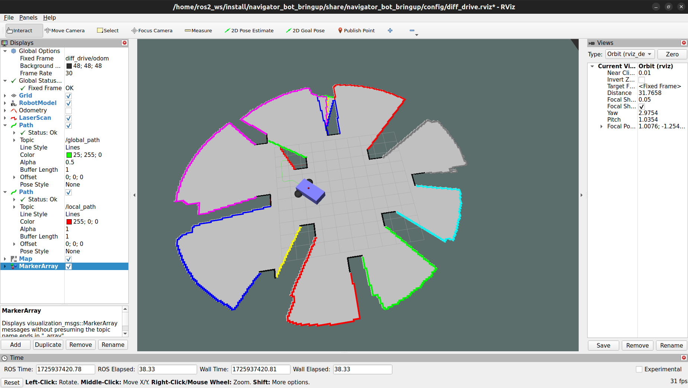
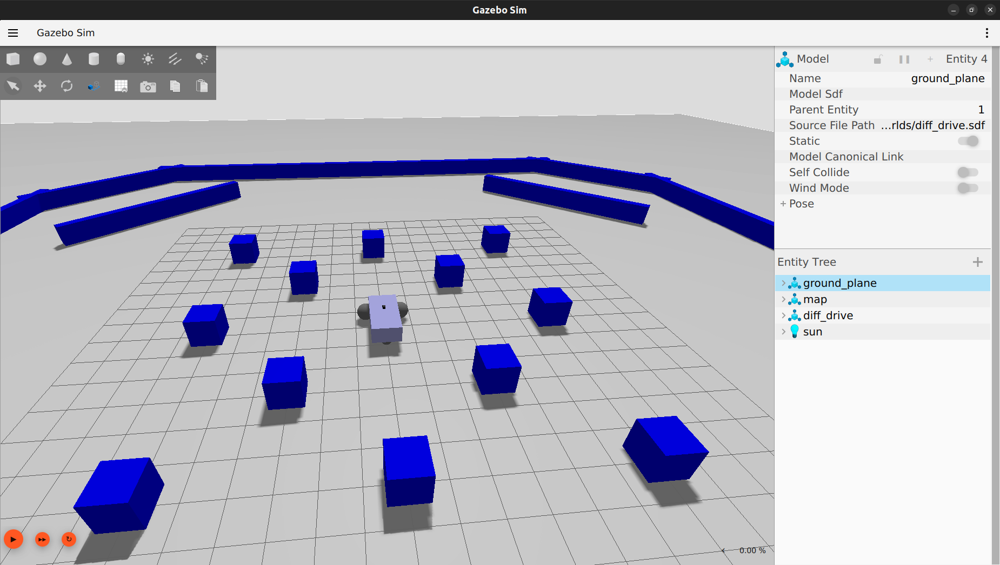
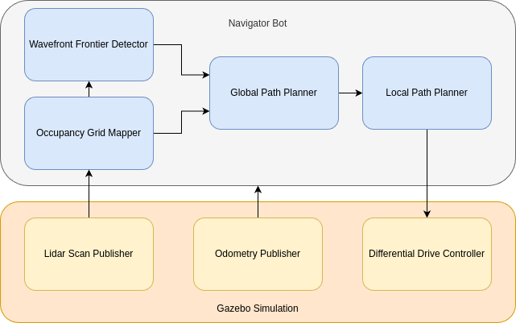

# Navigator Bot

This repository contains the code for a robot that continuously navigates its environment to explore new areas.

|         RViz          |         Gazebo          |
| :-------------------: | :---------------------: |
|  |  |

In the above images you are able to see the robot navigate the environment using an occupancy map created from lidar scans. Frontiers are detected in the occupancy map and clustered, each cluster displayed as a different colour. Lastly, the green path is displayed in front of the robot which it follows.

## Getting started

This repository has been tested with ROS 2 Jazzy and Gazebo Harmonic. You can use this [ros_docker](https://github.com/mpitropov/ros_docker) repository for a simple docker container with those installed.

With this repository in your ROS 2 workspace, run these commands:

```sh
colcon build
ros2 launch navigator_bot_bringup diff_drive.launch.py
```

## Architecture diagram



## Included packages

### Autonomy

To Be Included

### Gazebo

The `navigator_bot_bringup`, `navigator_bot_description` and `navigator_bot_gazebo` packages are modified from the [ros_gz_project_template](https://github.com/gazebosim/ros_gz_project_template) repository. Currently, the only changes were inside the `navigator_bot_gazebo` package to create the walls and blocks for the map.

- `navigator_bot_bringup`: Contains the launch file that will start up Gazebo, RViz, and all ROS nodes
- `navigator_bot_description`: Contains the `.sdf` file for the robot
- `navigator_bot_gazebo`: Contains the `.sdf` file with the world, plugins and links to the robot `.sdf` file to be loaded into gazebo
